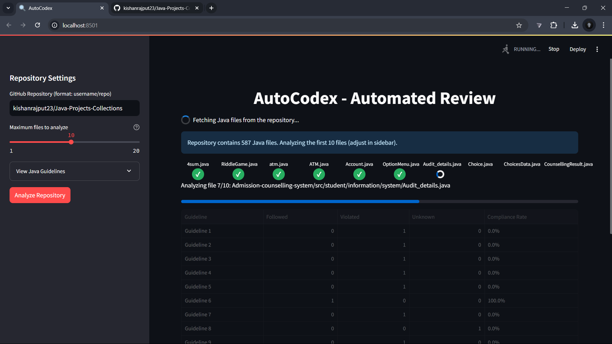
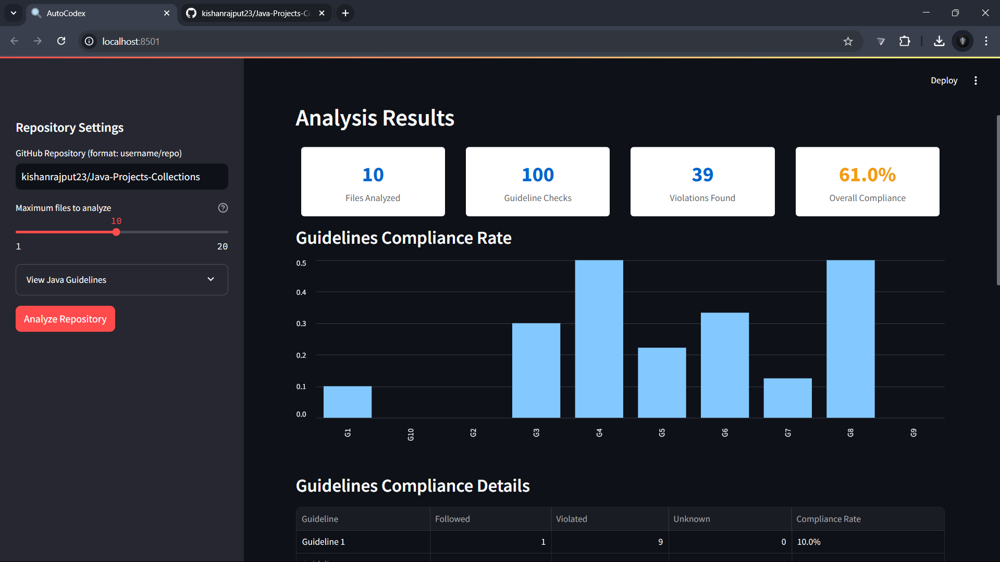
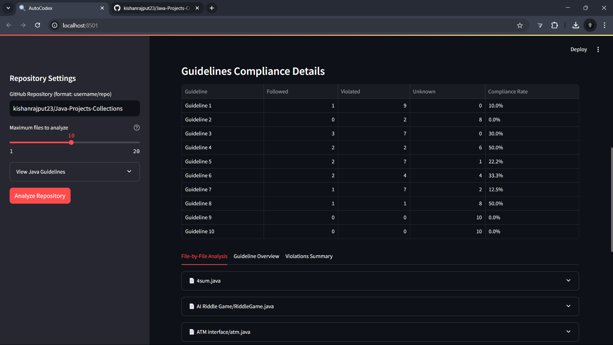
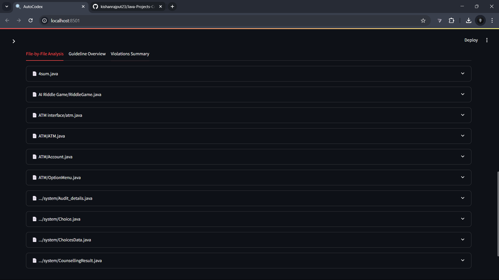
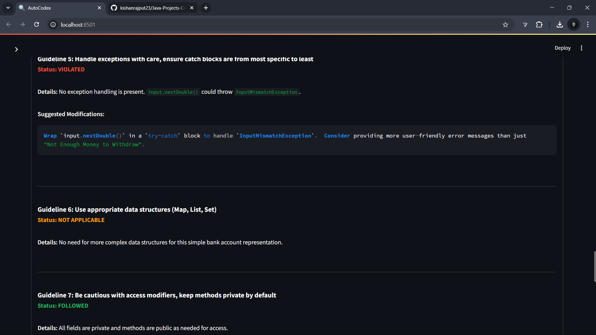
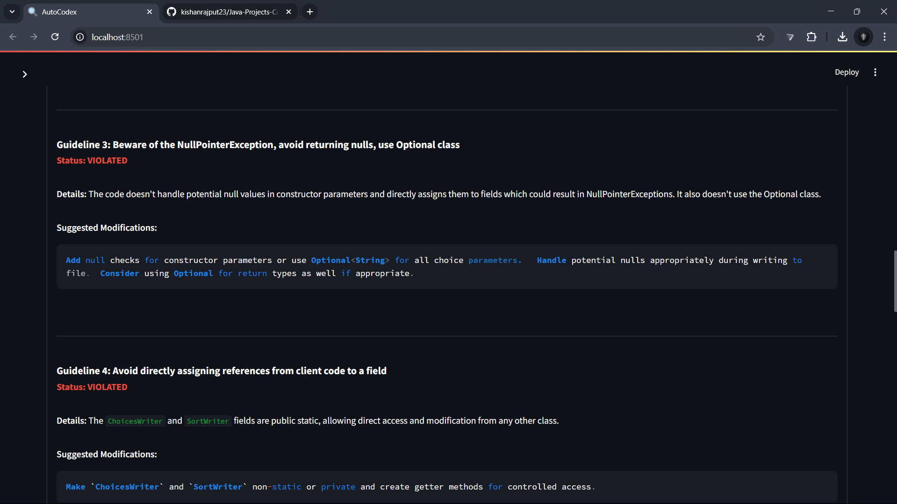
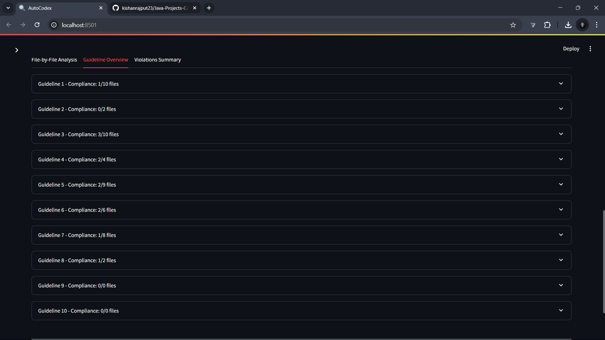
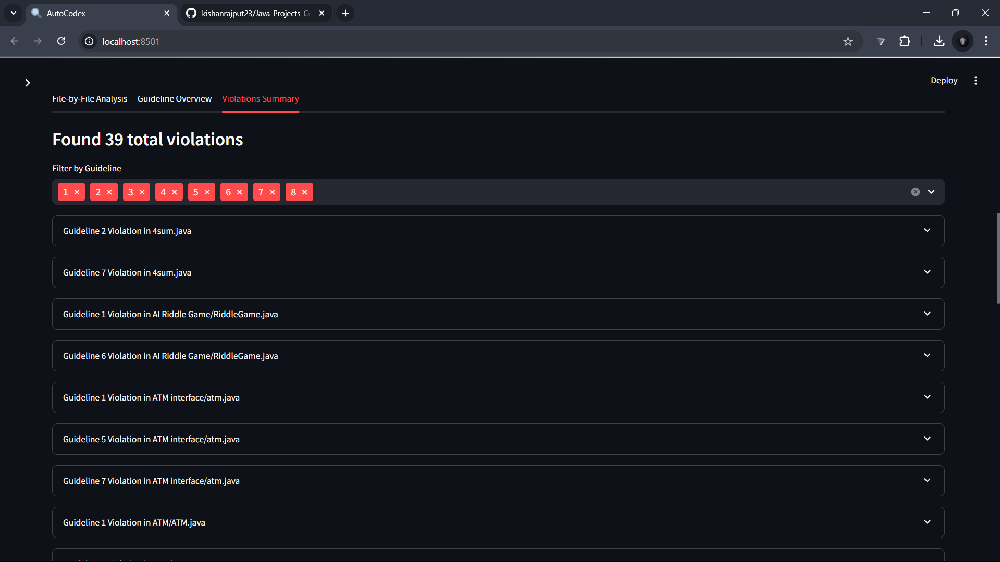
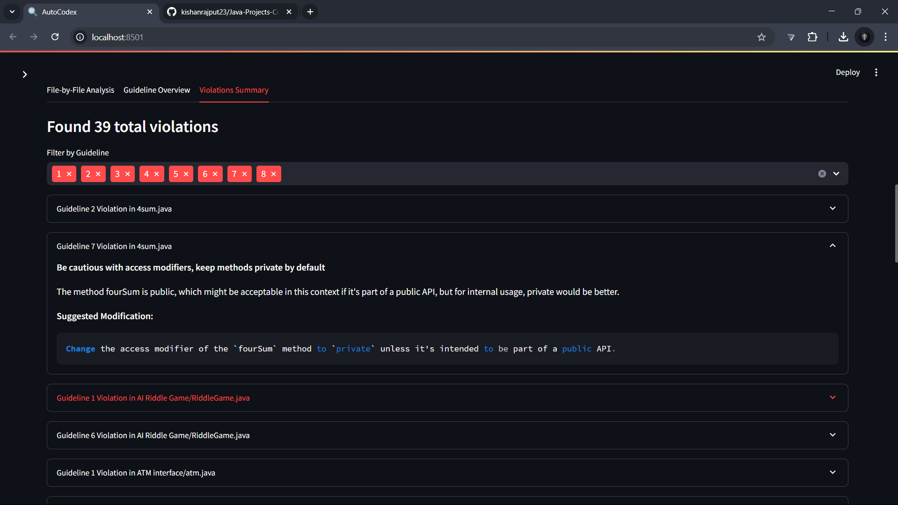

# AutoCodex - Automated Java Code Review

AutoCodex is a powerful tool for automated Java code reviews. It analyzes Java code from GitHub repositories using Google's Gemini AI to provide comprehensive feedback based on standard Java coding guidelines.

## Features

- **GitHub Integration**: Connect directly to any public GitHub repository
- **AI-Powered Analysis**: Leverages Google's Gemini 2.0 Flash model for intelligent code analysis
- **Comprehensive Guidelines**: Analyzes code against 10 essential Java coding practices
- **Interactive Dashboard**: Visual representation of compliance rates and issues
- **Detailed Reports**: File-by-file analysis with specific violation details
- **Suggested Fixes**: AI-generated code modification suggestions for violations

## Requirements

- Python 3.12+
- Streamlit
- Google Generative AI API key
- GitHub Personal Access Token

## Installation

1. Clone the repository:
   ```
   git clone https://github.com/yourusername/autocodex.git
   cd autocodex
   ```

2. Install dependencies:
   ```
   pip install streamlit requests google-generativeai python-dotenv pandas
   ```

3. Set up environment variables in a `.env` file:
   ```
   GITHUB_TOKEN=your_github_token
   GEMINI_API_KEY=your_gemini_api_key
   ```

## Getting API Keys

### GitHub Token
1. Go to GitHub → Settings → Developer settings → Personal access tokens
2. Generate a new token with `repo` scope
3. Copy the token to your `.env` file

### Gemini API Key
1. Visit Google AI Studio
2. Create a new API key
3. Copy the API key to your `.env` file

## Usage

1. Run the application:
   ```
   streamlit run app.py
   ```

2. Enter a GitHub repository in the format `username/repo`

3. Adjust the maximum number of files to analyze if needed (1-20)

4. Click "Analyze Repository"

5. View the detailed analysis results in the various tabs:
   - File-by-File Analysis
   - Guideline Overview
   - Violations Summary

## Java Guidelines Analyzed

The tool checks code against these guidelines:

1. Java code conventions (package names in lowercase, constants in all caps, variable names in CamelCase)
2. Usage of lambdas and streams in Java 8+
3. Null handling and Optional class usage
4. Reference assignment best practices
5. Exception handling patterns
6. Appropriate data structure usage
7. Access modifier practices
8. Interface-based programming
9. Interface design principles
10. hashCode and equals implementation

## Limitations

- Maximum of 20 files can be analyzed per run to avoid API rate limits
- Only analyzes Java files

##  Screenshots











